# Base de Datos — POP PEROTE

> **Motor:** MariaDB 10.6+ / InnoDB  
> **Charset:** `utf8mb4` / `utf8mb4_unicode_ci`  
> **Zona horaria:** `UTC-6` (Centro México)  
> **Versión del schema:** `1.0.0` *(revisado 2026-04-09)*  
> **Archivo SQL:** `backend/database/mariadb/001_schema_pop_perote.sql`

---

## Resumen de Módulos

| # | Módulo | Tablas | Descripción |
|---|--------|--------|-------------|
| 1 | **Usuarios & Auth** | `users`, `personal_access_tokens`, `password_reset_tokens` | Registro, roles y autenticación Sanctum |
| 2 | **Menú & Catálogo** | `categorias_menu`, `productos` | Productos del menú (Sushi, Alitas, Boneless, Crepas, Bebidas, Snacks) |
| 3 | **Promociones** | `promociones`, `promo_productos` | Ofertas activas, históricas y programadas |
| 4 | **POP Points** | `niveles_fidelidad`, `pop_points`, `pop_points_transacciones` | Sistema de lealtad con 4 niveles |
| 5 | **Pedidos** | `pedidos`, `pedido_items` | Pedidos (mesa / online / FoodBooking) |
| 6 | **POP Bar Stars** | `meseros`, `bar_stars_transacciones`, `bar_stars_ranking` | Ranking mensual de meseros por ventas de bebidas |
| 7 | **Facturación CFDI 4.0** | `datos_fiscales_clientes`, `solicitudes_cfdi`, `cfdi_log` | Ciclo de vida completo de facturas electrónicas |
| 8 | **Engagement** | `testimonios` | Reseñas y testimonios de clientes |
| 9 | **Config & Auditoría** | `configuracion`, `activity_log` | Parámetros del sistema y trazabilidad |
| 10 | **Horarios** | `horarios_atencion`, `horarios_especiales` | Horarios regulares semanales y días festivos/cierres |
| 11 | **Contenido Web** | `contenido_web`, `galeria` | CMS ligero: textos, imágenes y galería del sitio público |
| 12 | **Reservaciones** | `reservaciones` | Solicitudes de mesa (beneficio POP VIP / Elite) |

---

## Diagrama General (Entidad-Relación)

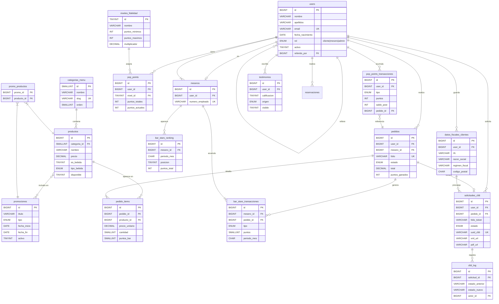

---

## Módulo 1 — Usuarios & Autenticación

### Diagrama

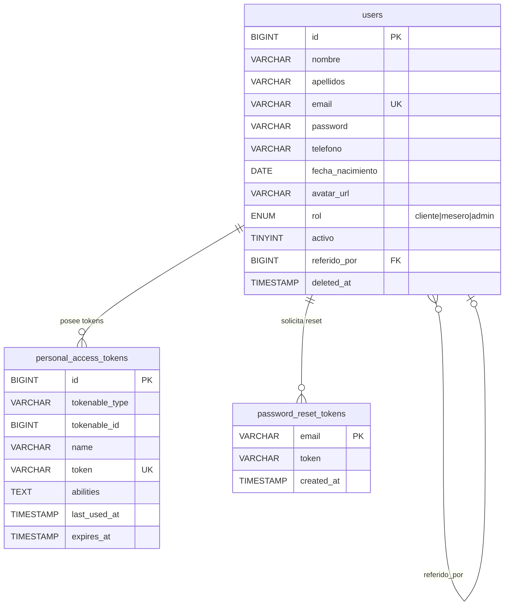

### Roles del Sistema

| Rol | Descripción | Acceso |
|-----|-------------|--------|
| `cliente` | Usuario registrado que ordena y acumula puntos | Público + dashboard propio |
| `mesero` | Personal de sala | Gestión de pedidos + ranking Bar Stars |
| `admin` | Administrador | Panel completo (CRUD + CFDI + ranking) |

> **Nota:** La autenticación usa **Laravel Sanctum** (`personal_access_tokens`). El token nunca viaja en el body del request — regla de oro del proyecto.

---

## Módulo 2 — Menú & Catálogo

### Diagrama

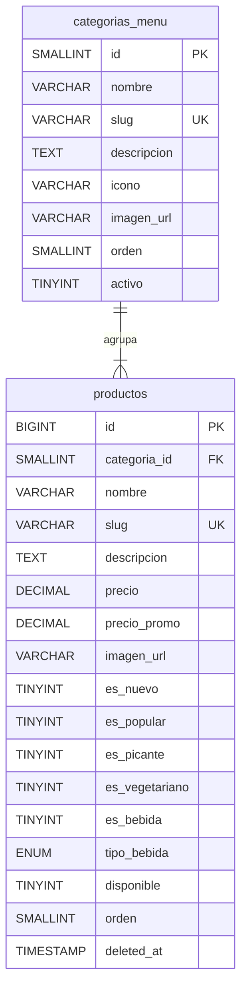

### Categorías predefinidas

| Orden | Categoría | Descripción |
|-------|-----------|-------------|
| 1 | 🍣 Sushi | 40+ rollos, nigiri, sashimi y creaciones de autor |
| 2 | 🍗 Alitas | Crujientes con 10 salsas secretas |
| 3 | 🔥 Boneless | Pechuga empanizada al momento |
| 4 | 🥞 Crepas | Dulces y saladas, receta tradicional |
| 5 | 🍹 Bebidas | Coctelería, margaritas, pitchers, botellas |
| 6 | 🍿 Snacks | Para picar y compartir |

> Los productos con `es_bebida = 1` y un `tipo_bebida` definido generan puntos en el sistema **POP Bar Stars**.

---

## Módulo 3 — Promociones

### Diagrama

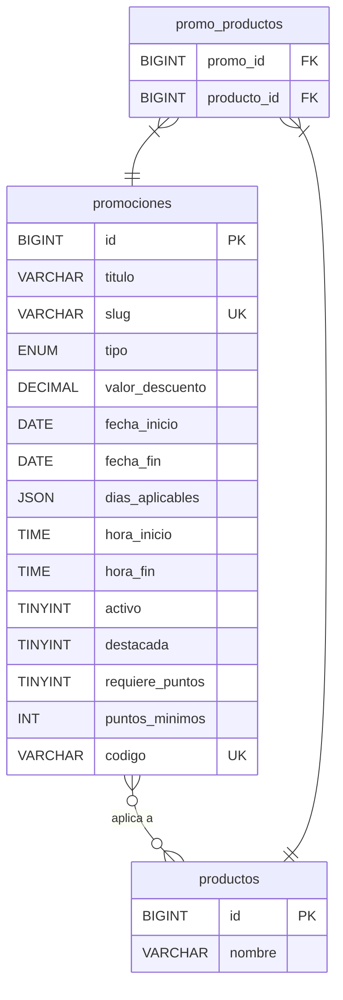

### Tipos de Promoción

| Tipo | Ejemplo |
|------|---------|
| `porcentaje` | 20% de descuento en sushi |
| `2x1` | Sushiércoles — 2x1 en rollos seleccionados |
| `precio_fijo` | Combo especial a $199 MXN |
| `producto_gratis` | Rollo gratis en tu visita #5 (POP VIP) |
| `puntos_dobles` | 2x puntos en días de bajo tráfico |
| `personalizado` | Cualquier otra mecánica |

---

## Módulo 4 — Sistema de Lealtad POP Points

### Diagrama

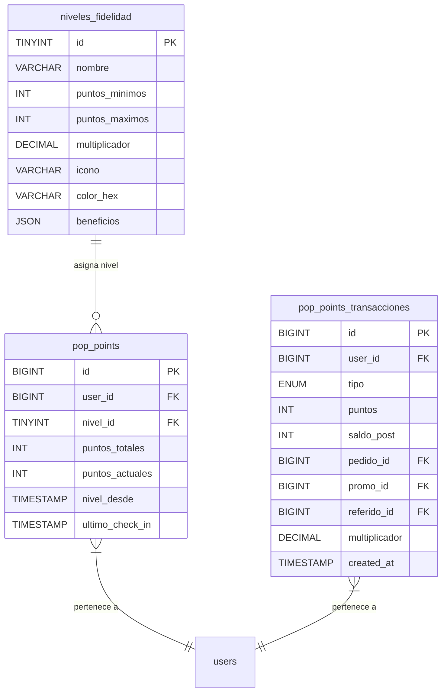

### Niveles y Multiplicadores

| Nivel | Puntos | Multiplicador | Beneficios clave |
|-------|--------|---------------|-----------------|
| 🎖️ POP Fan | 0 – 499 | ×1.00 | Acceso básico, 1 pt por $10 MXN |
| ❤️ POP Lover | 500 – 1,499 | ×1.10 | +10% pts, promo exclusiva mensual, bebida de cumpleaños |
| 🏆 POP VIP | 1,500 – 2,999 | ×1.25 | +25% pts, rollo gratis c/5 visitas, acceso anticipado |
| 💎 POP Elite | 3,000+ | ×1.50 | +50% pts, reserva prioritaria, eventos, 1 buffet/mes |

### Formas de Ganar Puntos

| Acción | Puntos | Campo `tipo` |
|--------|--------|--------------|
| Primer registro | +50 | `ganado_registro` |
| Compra ($10 MXN = 1 pt) | Variable | `ganado_compra` |
| Check-in en restaurante | +25 | `ganado_checkin` |
| Reseña verificada Google | +100 | `ganado_resena` |
| Referir un amigo | +200 | `ganado_referido` |
| Cumpleaños automático | +150 | `ganado_cumpleanos` |
| Compra en día bajo tráfico | ×2 pts | `ganado_dia_bajo` |
| Share en redes sociales | +30 | `ganado_social` |

---

## Módulo 5 — Pedidos

### Diagrama

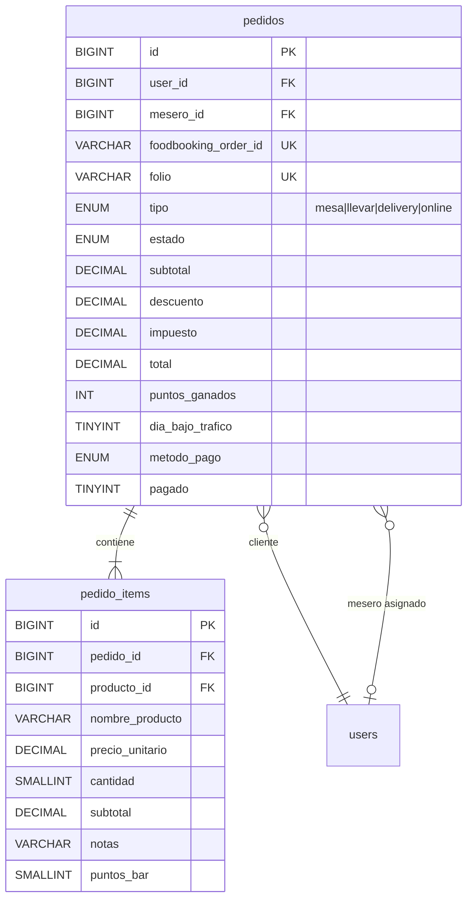

### Flujo de Estado de Pedido

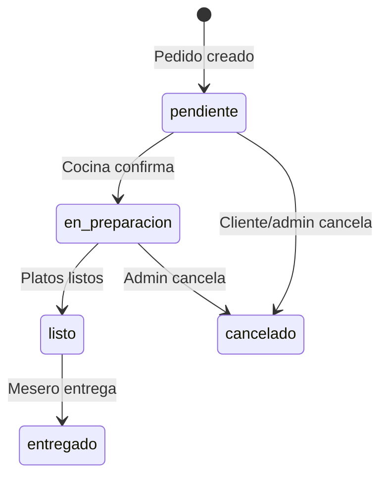

> **Integración FoodBooking:** El campo `foodbooking_order_id` guarda la referencia del pedido externo. El folio interno sigue el formato `POP-YYYYMMDD-NNNN`.

---

## Módulo 6 — POP Bar Stars (Ranking de Meseros)

### Diagrama

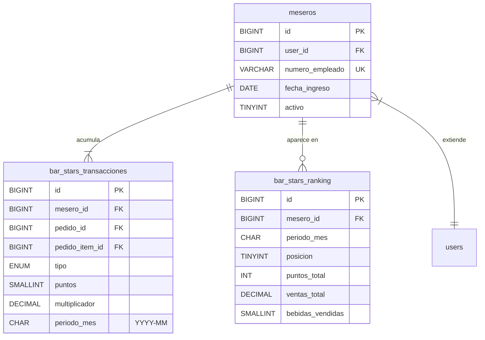

### Tabla de Puntos por Venta

| Acción | Puntos | `tipo` |
|--------|--------|--------|
| Vender 1 coctel / margarita | +10 | `coctel_margarita` |
| Vender 1 bebida premium | +15 | `bebida_premium` |
| Vender 1 jarra / compartida | +25 | `jarra_compartida` |
| Venta de botella completa | +50 | `botella_completa` |
| Combo comida + bebida | +20 | `combo_comida_bebida` |
| Upselling (upgrade de bebida) | +15 | `upselling` |
| Mejor calificación con mención | +30 | `calificacion_cliente` |
| "Bebida del mes" especial | ×2 sobre pts | `bebida_del_mes` |

> El campo `periodo_mes` (`YYYY-MM`) permite agrupar y resetear el ranking mensualmente. `bar_stars_ranking` es un **snapshot desnormalizado** que se recalcula al cierre de cada mes.

---

## Módulo 7 — Facturación CFDI 4.0

### Diagrama

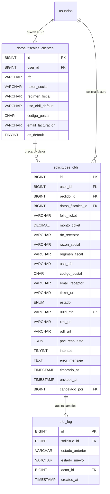

### Ciclo de Vida de una Solicitud CFDI

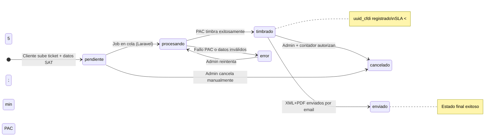

### Campos Obligatorios CFDI 4.0

| Campo | Fuente | Descripción |
|-------|--------|-------------|
| `rfc_receptor` | Cliente | 12-13 caracteres, validado vs SAT |
| `razon_social` | Cliente | Debe coincidir **exactamente** con el SAT |
| `regimen_fiscal` | Cliente | Código SAT (ej: `626` Simplificado de Confianza) |
| `uso_cfdi` | Cliente | Código SAT (ej: `G03` Gastos en general) |
| `codigo_postal` | Cliente | C.P. fiscal de 5 dígitos |
| `folio_ticket` | Ticket físico | Folio del comprobante del restaurante |
| `monto_ticket` | Ticket físico | Monto total del consumo |

> **Regla crítica:** El sistema **NUNCA rechaza automáticamente** solicitudes tardías. La decisión de cancelación es manual: admin + contadora.

---

## Módulo 8 — Engagement (Testimonios)

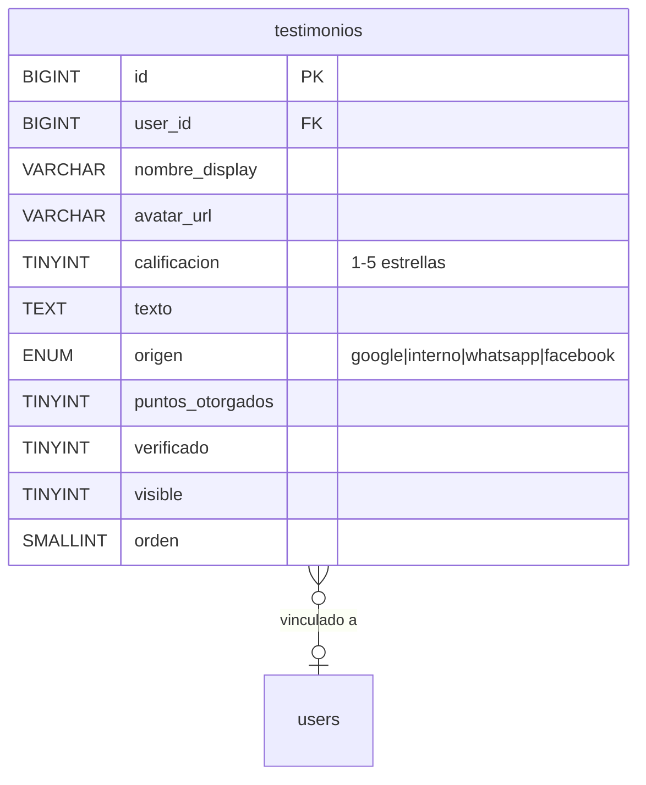

> Los testimonios de Google con `puntos_otorgados = 0` quedan pendientes de verificación manual. Al aprobarlos, se ejecuta la transacción de +100 pts en `pop_points_transacciones`.

---

## Módulo 9 — Configuración & Auditoría

### Parámetros de Configuración

| Clave | Valor inicial | Descripción |
|-------|---------------|-------------|
| `iva_porcentaje` | `16` | IVA aplicado en pedidos |
| `puntos_por_peso` | `0.1` | 1 pt por cada $10 MXN |
| `puntos_bienvenida` | `50` | Bonus de registro |
| `cfdi_sla_horas` | `24` | SLA máximo facturación |
| `pac_proveedor` | `facturama` | Proveedor PAC activo |
| `restaurant_rfc` | `PPG200115XY3` | RFC del emisor |
| `bebida_del_mes_multiplicador` | `2.0` | ×2 pts Bar Stars |

### Auditoría (activity_log)

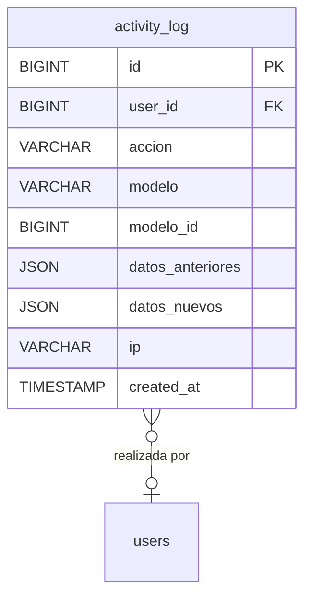

---

## Módulo 10 — Horarios de Atención

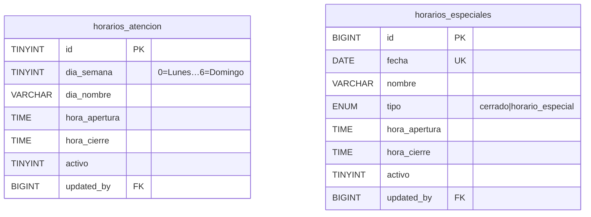

> Ambas tablas se gestionan desde el panel admin. `horarios_especiales` prevalece sobre `horarios_atencion` cuando existe una entrada para la fecha consultada.

---

## Módulo 11 — Contenido Web (CMS Ligero)

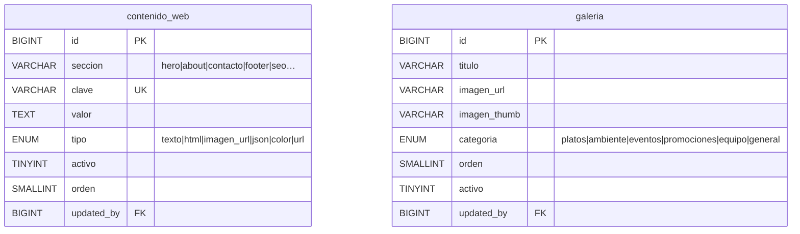

### Secciones predefinidas `contenido_web`

| Sección | Descripción |
|---------|-------------|
| `hero` | Título, subtítulo, CTA e imagen principal del landing |
| `about` | Historia del restaurante, valores, chef |
| `contacto` | Dirección, teléfono, email, mapa embed URL |
| `footer` | Texto legal, horarios resumidos, redes sociales |
| `seo` | Meta title, meta description, OG image por página |

---

## Módulo 12 — Reservaciones

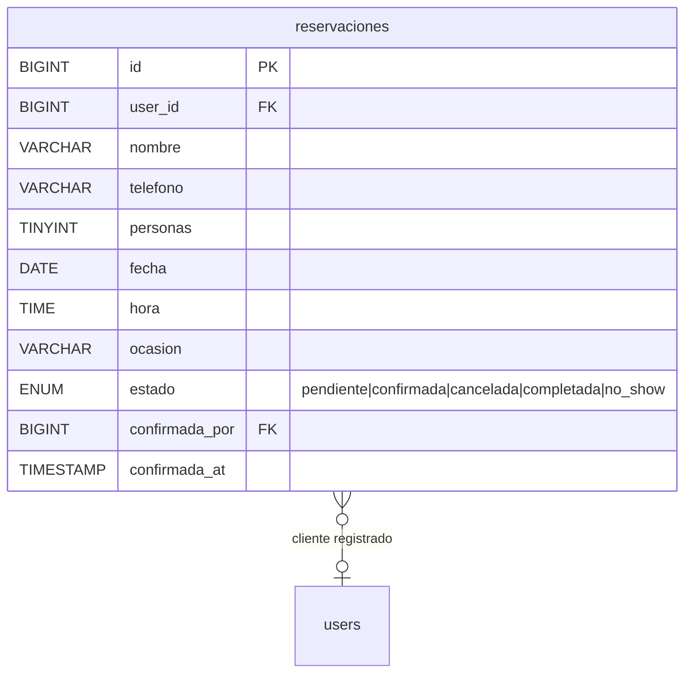

### Flujo de Estado

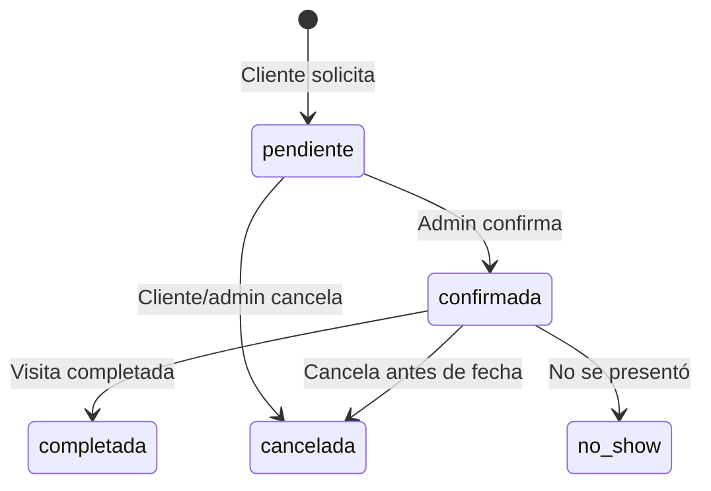

> Reservaciones prioritarias son un beneficio de niveles **POP VIP** y **POP Elite**. Clientes no registrados pueden reservar igual pero sin beneficios de prioridad.

---

## Guía de Relaciones Clave

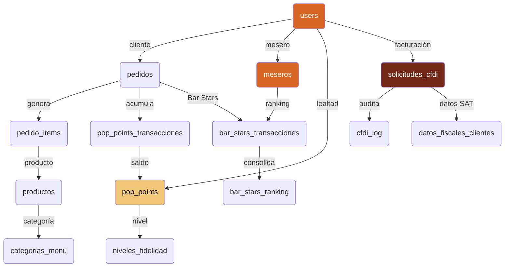

---

## Convenciones del Schema

| Convención | Detalle |
|------------|---------|
| **PKs** | `BIGINT UNSIGNED AUTO_INCREMENT` en tablas transaccionales; `SMALLINT/TINYINT` en catálogos |
| **Soft deletes** | `deleted_at TIMESTAMP NULL` en `users`, `productos`, `promociones` |
| **Timestamps** | `created_at` y `updated_at` en todas las tablas; `created_at` solo en logs |
| **Importes** | `DECIMAL(10,2)` para totales, `DECIMAL(8,2)` para precios unitarios |
| **Enumeraciones** | `ENUM(...)` para estados y tipos con valores finitos |
| **JSON** | Para estructuras flexibles: beneficios, dias_aplicables, pac_respuesta |
| **Índices** | En todas las FKs + columnas de búsqueda frecuente (estado, fecha, rol) |
| **Charset** | `utf8mb4` para soporte completo de emojis y caracteres especiales |
| **Zona horaria** | `UTC-6` Centro México configurada a nivel de conexión |

---

## Consideraciones de Seguridad

- ✅ **Prepared statements** — Obligatorio en todas las consultas (PDO / Laravel Query Builder)
- ✅ **Contraseñas** — `bcrypt` en el campo `password` (never plain text)
- ✅ **Tokens** — Gestionados por Sanctum; solo se almacena el hash en `personal_access_tokens`
- ✅ **RFC** — Validación de patrón `[A-ZÑ&]{3,4}[0-9]{6}[A-Z0-9]{3}` en frontend + backend
- ✅ **Archivos CFDI** — `ticket_url`, `xml_url`, `pdf_url` deben almacenarse fuera del webroot

---

*Generado para POP PEROTE · Justo Sierra No. 11, Col. Amado Nervo, Perote, Veracruz*
